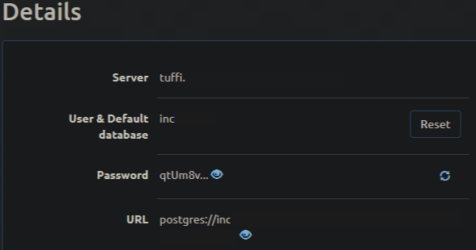

# Cartoleiros Backend
 This repository represents a backend developed for the app "Cartoleiros".

This backend is responsible for the management of app users, register new users, and so on. Basicly, this repository is a CRUD (create, read, update and delete) for the app.

## Getting Started

These instructions will get you a copy of the project up and running on your local machine for development and testing purposes. See deployment for notes on how to deploy the project on a live system.

### Prerequisites

What things you need to install the software and how to install them

```
node
npm 
```
### Configuring Postgres Database

Open up the file database.js on the path src/config and replace where we had "<>" with your values. In this project was used a platform called ElephantSQL, where we can host a postgres database for free. Below there is an example for configure your own postgres database.

<p align="center">
  
</p>

* Replace url for the "URL" contained on ElephantSQL;
* Replace host for the "Server" contained on ElephantSQL;
* Replace username and database for the "User & Default database" contained on ElephantSQL, and finally
* Replace password for "password" contained on ElephantSQL
``` Javascript
module.exports = {
   dialect: 'postgres',
   url: "<YOUR URL HERE>",
   host: '<YOUR HOST HERE>',
   username: '<YOUR USER NAME HERE>',
   password: '<YOUR PASSWORD HERE>',
   database: '<YOUR DATABASE HERE>',
   ssl: true,
   define: {
      timestamps: true,
      underscored: true
   }
}
```

### Installing

A step by step series of examples that tell you how to get a development env running

To install node and npm, go to the link below and download the LTS version

``` 
https://nodejs.org/en/download/
```

Clone this repository, open up on your favorite code editor and then run the command line below to install all needed packages to run in your local machine

``` 
npm install
```
After install all needed packages, we need to run the migrations to create the tables, so we run the command line:
```
npx sequelize db:migrate
```
After that, run de command:

```
npm run dev
```

End with an example of getting some data out of the system or using it for a little demo

## Running the tests

Explain how to run the automated tests for this system (WIP)

### Break down into end to end tests

Explain what these tests test and why

```
Give an example
```

### And coding style tests

Explain what these tests test and why (WIP)

```
Give an example
```

## Deployment

WIP

## Built With

* [NodeJS](https://nodejs.org/en/) - The JS framework used
* [Express](https://expressjs.com/en/4x/api.html) - Framework NodeJS responsible for management the routes of the API
* [Sequelize](https://sequelize.org/v5/) - ORM for Postgres, MySQL, MariaDB, SQLite and Microsoft SQL Server
* [Md5](https://www.npmjs.com/package/md5) - a JavaScript function for hashing messages with MD5.
* [Postgres](https://www.postgresql.org/) - Open Source object-relational database.
* [ElephantSQL](https://www.elephantsql.com/) - Platform to manage and use Postgres database as a service.

## Contributing

Please read [CONTRIBUTING.md]() for details on our code of conduct, and the process for submitting pull requests to us.

## Versioning

WIP

## Authors

* **André Macena** - *Initial work* - [Cartoleiros](https://github.com/andrmacena/cartoleiros-backend)

See also the list of [contributors](https://github.com/andrmacena/cartoleiros-backend/graphs/contributors) who participated in this project.

## License

This project is licensed under the MIT License - see the [LICENSE.md](LICENSE.md) file for details

## Acknowledgments

* Hat tip to anyone whose code was used
* Inspiration
* etc
